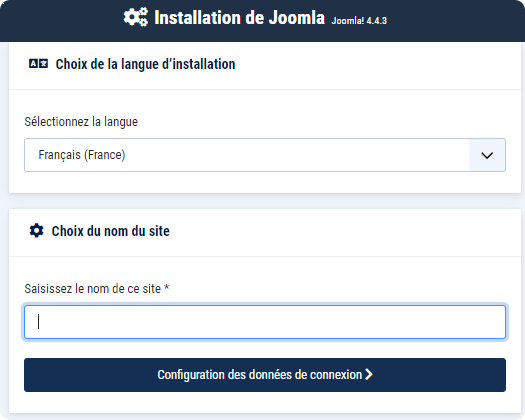
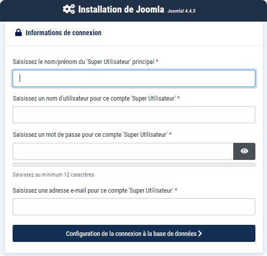
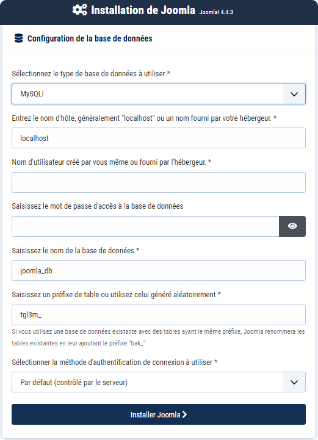
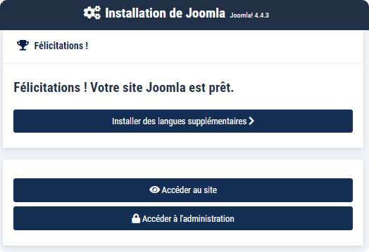

# Docker Joomla

# Accès

PHPMyAdmin
http://localhost:8181

MySQL
localhost:3306

App:
http://localhost:8080

---

# Lancement de la stack

---

# Joomla

Allez sur l'adresse:

On arrive sur la page d'installation de Joomla

Saisie des informations de connexion de l'administrateur

Saisie des informations de la base de données

> Cf. le fichier .env.docker

Type: MySQL (PDO)
Hôte: joomladb
Utilisateur: joomla
Mot de passe: joomla
Base de données: joomla

